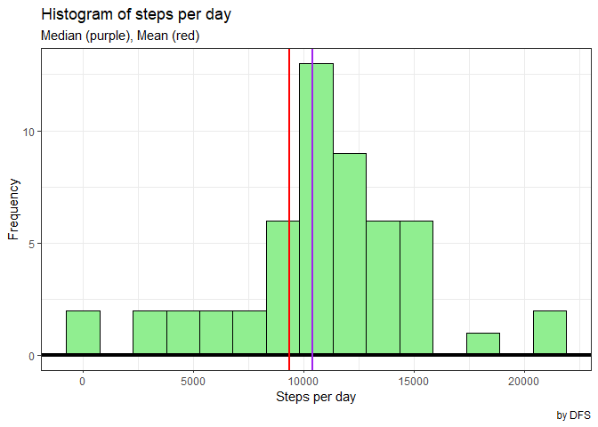
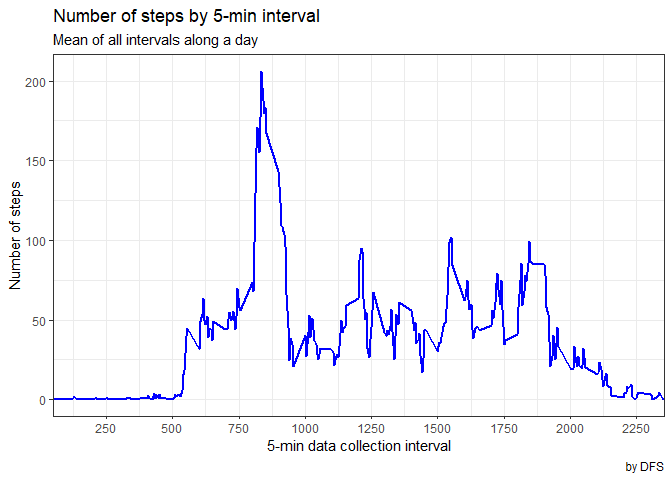
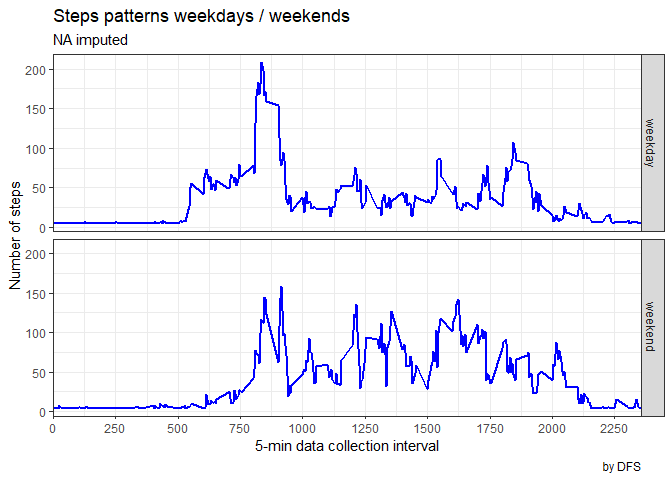

### **Libraries**

Those libraries has been used to work with the dataset.


```r
library(tidyverse)
```

```
## -- Attaching packages ------------------------------------------------------------------------------------- tidyverse 1.3.0 --
```

```
## v ggplot2 3.3.2     v purrr   0.3.4
## v tibble  3.0.3     v dplyr   1.0.2
## v tidyr   1.1.2     v stringr 1.4.0
## v readr   1.3.1     v forcats 0.5.0
```

```
## -- Conflicts ---------------------------------------------------------------------------------------- tidyverse_conflicts() --
## x dplyr::filter() masks stats::filter()
## x dplyr::lag()    masks stats::lag()
```

### **Loading and preprocessing the data**

This process considers that the dataset is unzipped onto `\data` folder on your working directory. I'm also adding two new variables, `weekday` and `is.weekend`, to categorize the database later on.


```r
activity <- read_csv("data/activity.csv", 
                     na = "NA",
                     col_types = cols(steps = col_integer(), 
                                      date = col_date(format = "%Y-%m-%d"), 
                                      interval = col_integer())) %>%
  
  mutate(weekday = as.factor(weekdays(date))) %>%
  
  mutate(is.weekend = if_else(weekday %in% c("Saturday", "Sunday"), 
                              "weekend", 
                              "weekday") %>% as.factor())

summary(activity)
```

```
##      steps             date               interval           weekday    
##  Min.   :  0.00   Min.   :2012-10-01   Min.   :   0.0   Friday   :2592  
##  1st Qu.:  0.00   1st Qu.:2012-10-16   1st Qu.: 588.8   Monday   :2592  
##  Median :  0.00   Median :2012-10-31   Median :1177.5   Saturday :2304  
##  Mean   : 37.38   Mean   :2012-10-31   Mean   :1177.5   Sunday   :2304  
##  3rd Qu.: 12.00   3rd Qu.:2012-11-15   3rd Qu.:1766.2   Thursday :2592  
##  Max.   :806.00   Max.   :2012-11-30   Max.   :2355.0   Tuesday  :2592  
##  NA's   :2304                                           Wednesday:2592  
##    is.weekend   
##  weekday:12960  
##  weekend: 4608  
##                 
##                 
##                 
##                 
## 
```


Summarizing the data set, it is possible to notice a total of 2304 `NA`s on the steps variable.


### **What is mean total number of steps taken per day?**

For this topic a new data frame has been created


```r
act_mean <- activity %>%
    
    group_by(date, weekday, is.weekend) %>%

    summarise(sum = sum(steps, na.rm = TRUE), 
              mean = mean(steps, na.rm = TRUE))
```

```
## `summarise()` regrouping output by 'date', 'weekday' (override with `.groups` argument)
```

```r
act_mean %>%
  
  na.omit() %>%
  
  ggplot() +
  
  geom_histogram(aes(sum), bins = 15, fill = "lightgreen", color = "black") + 
  
  geom_hline(yintercept = 0, size = 1.5) +
  
  geom_vline(xintercept = mean_steps <- mean(act_mean$sum), color = "red", size = 1) +

  geom_vline(xintercept = median_steps <- median(act_mean$sum), color = "purple", size = 1) + 
  
  labs(title = "Histogram of steps per day",
       subtitle = "Median (purple), Mean (red)",
       caption = "by DFS") +
  
  xlab("Steps per day") +
  
  ylab("Frequency") +
  
  theme_bw()
```

<!-- -->
  
The daily mean and median steps are **9354.2295082** and **10395**, respectively.
  
### **What is the average daily activity pattern?**  
  
  I have created the `daily pattern` Dataframa using summarise and mean().  
  


```r
daily_pattern <- activity %>%    # Daily steps pattern
  
  group_by(interval) %>%
  
  summarise(mean_steps = mean(steps, na.rm = TRUE))
```

```
## `summarise()` ungrouping output (override with `.groups` argument)
```

```r
summary(daily_pattern)
```

```
##     interval        mean_steps     
##  Min.   :   0.0   Min.   :  0.000  
##  1st Qu.: 588.8   1st Qu.:  2.486  
##  Median :1177.5   Median : 34.113  
##  Mean   :1177.5   Mean   : 37.383  
##  3rd Qu.:1766.2   3rd Qu.: 52.835  
##  Max.   :2355.0   Max.   :206.170
```

  And plotted the data:


```r
daily_pattern %>%
  
  na.omit() %>%
  
  ggplot() +
  
  scale_x_continuous(expand = c(0,0), n.breaks = 10) +

  coord_cartesian(xlim = c(50, 2355)) + 
  
  geom_line(aes(interval, mean_steps), size = .8, color = "blue") + 
  
  labs(title = "Number of steps by 5-min interval",
     subtitle = "Mean of all intervals along a day",
     caption = "by DFS") +
  
  xlab("5-min data collection interval") +
  
  ylab("Number of steps") +
  
  theme_bw()
```

<!-- -->


The following code has been used to extract the largest step count by interval:


```r
max_steps_interval <- daily_pattern %>% filter(mean_steps == max(mean_steps))
```

The interval which has occurred the largest amount of steps is **835** with **206** steps counted.


### **Imputing missing values**

There are a total of 2304 `NA`s on the step values. The imputation method is replacing NA for the mean value for all intervals.


```r
na_imputed <- activity %>%
  
  filter(is.na(steps)) %>%
  
  mutate(steps = as.integer(mean(activity$steps, na.rm = TRUE))) %>%
  
  rbind(., activity %>% filter(!is.na(steps)))
```

### **Are there differences in activity patterns between weekdays and weekends?**

Using the dataframe `na_imputed`, week/weekend have been filtered and plot to show the different patterns.


```r
na_imputed %>%
  
  group_by(is.weekend, interval) %>%
  
  summarise(means = mean(steps)) %>%
  
  ggplot() +
  
  scale_x_continuous(expand = c(0,0), n.breaks = 10) +

  geom_line(aes(interval, means), size = .8, color = "blue") + 
  
  facet_grid(is.weekend ~ .) +
  
  labs(title = "Steps patterns weekdays / weekends",
     subtitle = "NA imputed",
     caption = "by DFS") +
  
  xlab("5-min data collection interval") +
  
  ylab("Number of steps") +
  
  theme_bw()
```

```
## `summarise()` regrouping output by 'is.weekend' (override with `.groups` argument)
```

<!-- -->


