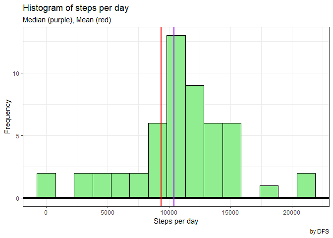

### **Libraries**

Those libraries were used to work with the dataset.


```r
library(tidyverse)
```

```
## -- Attaching packages --------------------------------------------------------------------------------- tidyverse 1.3.0 --
```

```
## v ggplot2 3.3.2     v purrr   0.3.4
## v tibble  3.0.3     v dplyr   1.0.2
## v tidyr   1.1.2     v stringr 1.4.0
## v readr   1.3.1     v forcats 0.5.0
```

```
## -- Conflicts ------------------------------------------------------------------------------------ tidyverse_conflicts() --
## x dplyr::filter() masks stats::filter()
## x dplyr::lag()    masks stats::lag()
```

### Loading and preprocessing the data

This process considers that the dataset is unzipped on data folder on your working directory.


```r
activity <- read_csv("data/activity.csv", 
                     na = "NA",
                     col_types = cols(steps = col_integer(), 
                                      date = col_date(format = "%Y-%m-%d"), 
                                      interval = col_integer()))
```

### Preprocessing the data


```r
summary(activity)
```

```
##      steps             date               interval     
##  Min.   :  0.00   Min.   :2012-10-01   Min.   :   0.0  
##  1st Qu.:  0.00   1st Qu.:2012-10-16   1st Qu.: 588.8  
##  Median :  0.00   Median :2012-10-31   Median :1177.5  
##  Mean   : 37.38   Mean   :2012-10-31   Mean   :1177.5  
##  3rd Qu.: 12.00   3rd Qu.:2012-11-15   3rd Qu.:1766.2  
##  Max.   :806.00   Max.   :2012-11-30   Max.   :2355.0  
##  NA's   :2304
```

### What is mean total number of steps taken per day?


```r
act_mean <- activity %>%
    
    group_by(date) %>%

    summarise(sum = sum(steps, na.rm = TRUE), 
              mean = mean(steps, na.rm = TRUE)) %>%
    
    filter(sum != 0)
```

```
## `summarise()` ungrouping output (override with `.groups` argument)
```

```r
daily_mean <- act_mean %>% summarise(mean = mean(mean, na.rm = TRUE)) %>% as.numeric()

act_mean %>%    
        
    ggplot() +
    
    geom_line(aes(date, mean))
```

<!-- -->

Daily 37.3825996

### What is the average daily activity pattern?


### Imputing missing values


## Are there differences in activity patterns between weekdays and weekends?
